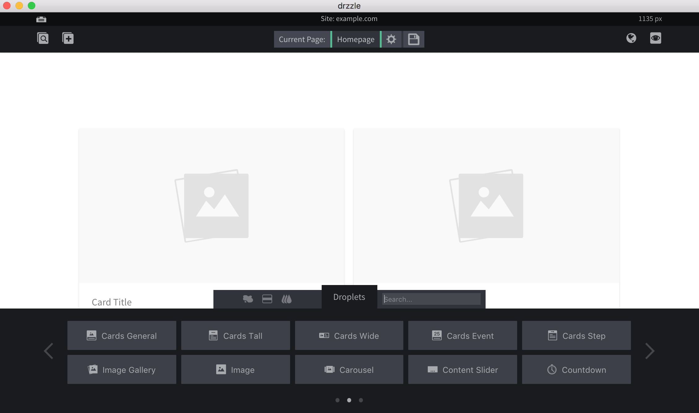
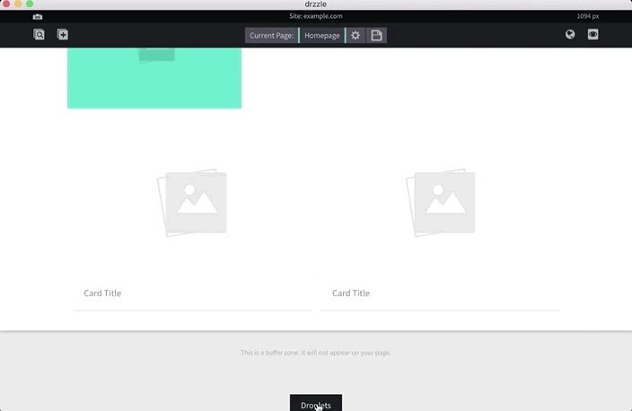

# Droplets

In the site editor, you will notice the droplets tab at the bottom of the screen. Here you can filter and find droplets to add to your pages.

## Filtering
You can filter droplets in this tab by types (puddles, content blocks and all types) in the top left filter bar. Additionally, you can search for droplets by name in the top right search bar.

## Adding Droplets

Adding droplets to pages is as easy as dragging and dropping them where you want them. All droplet types can be dropped inside of a section at the very least. Certain droplet types can be dropped in other areas (see [puddles](/components/puddles/#droplets-allowed) and [content blocks](/components/content-blocks/#allowed-targets)).

## Editing Droplets

Every droplet, except for general text, has a its own edit bubble where there are controls to style, position and add options for it that are specifically made for the droplet. There are 2 ways to open the edit bubble:

1) The first method is to open the droplet options by hovering over the droplet's drop icon then click the edit button.

2) The second method is a shortcut, simply right click on the droplet and the bubble should open.

In order to save changes to any updates on your droplets, you need to click the "done" button in the edit bubble then open the save options modal in the top control bar. From there you will need to save the page.

## Rearranging Droplets

To rearrange droplets, open the droplet options by hovering over the drop icon on the droplet. Then click and drag the green move icon.

## Deleting Droplets

To delete droplets you will need to open the droplet options by hovering over the drop icon on the droplet then click the red remove button. To save changes, you will also need to open the save options modal from the top control bar and save the page. Bare in mind, when you edit, delete or add droplets in a _template_, every page that uses that template will be updated with those changes.

