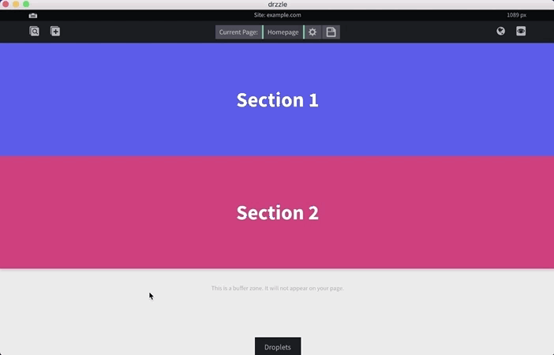

# Sections

## Adding
Sections can be added in between other sections and rearranged at will. To add them, hover over any existing section until you see a center black "Add Section Here" button, then click that.

## Adjust Height
Sections offer an easy way to adjust it's height. There is an area at the bottom of each section that allows you to click and drag up or down to adjust. Bare in mind that this height setting only takes effect for desktop sizes. In mobile view, it will not show.

## Editing
Unlike droplets, sections do not have edit bubbles. To edit a section, you need to open the section options and click the "Edit Section" button to launch it's edit modal.

Here you can manually edit the section's height, background type (currently only solid colors or images), give it an id for anchor scrolling, a shadow or align it's content.

## Deleting
To delete a section, hover over the section to open the section options then click the "Remove from page" button. Then click yes on the confirmation modal.

