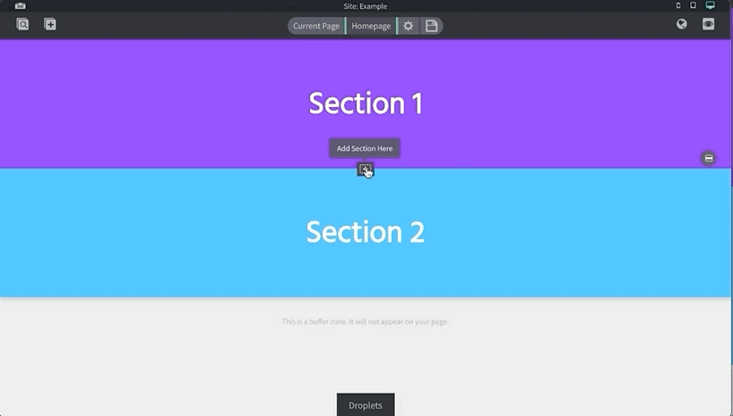
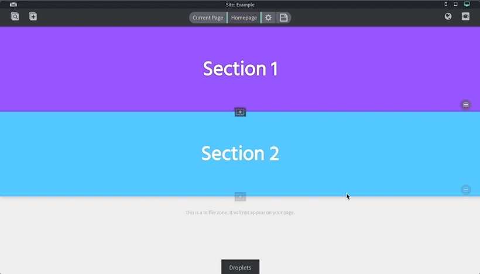
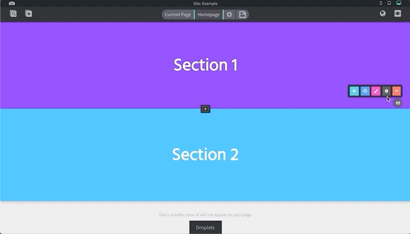
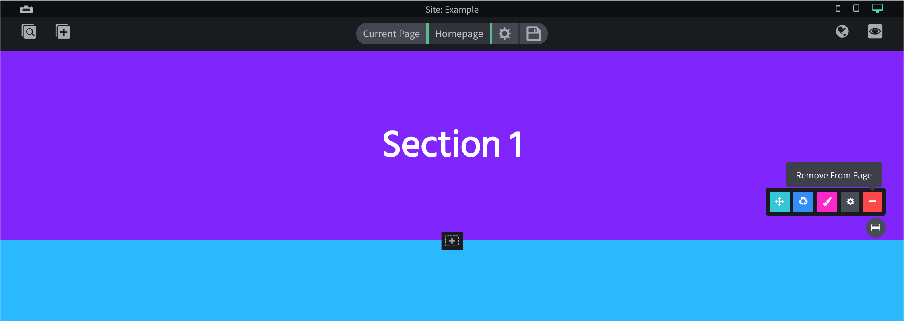

# Sections

## Adding
Sections can be added in between other sections and rearranged at will. To add them, hover over any existing section until you see a center black "Add Section Here" button, then click that.

## Adjust Height
Sections offer an easy way to adjust it's height. There is an area at the bottom of each section that allows you to click and drag up or down to adjust.

## Editing
To edit a section, you need to open the section options and click the "Section Settings" button to open any settings like scroll id's etc. To edit a section's styling, you need to open the options and click "Style Droplet".

## Deleting
To delete a section, hover over the section to open the section options then click the "Remove from page" button. Then click yes on the confirmation modal.

