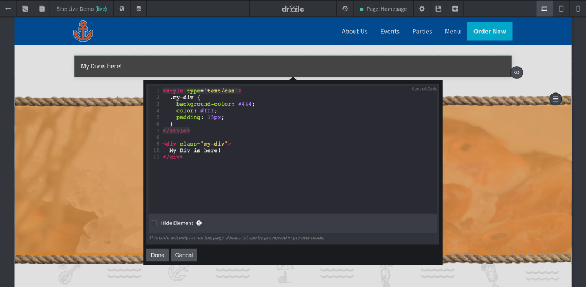
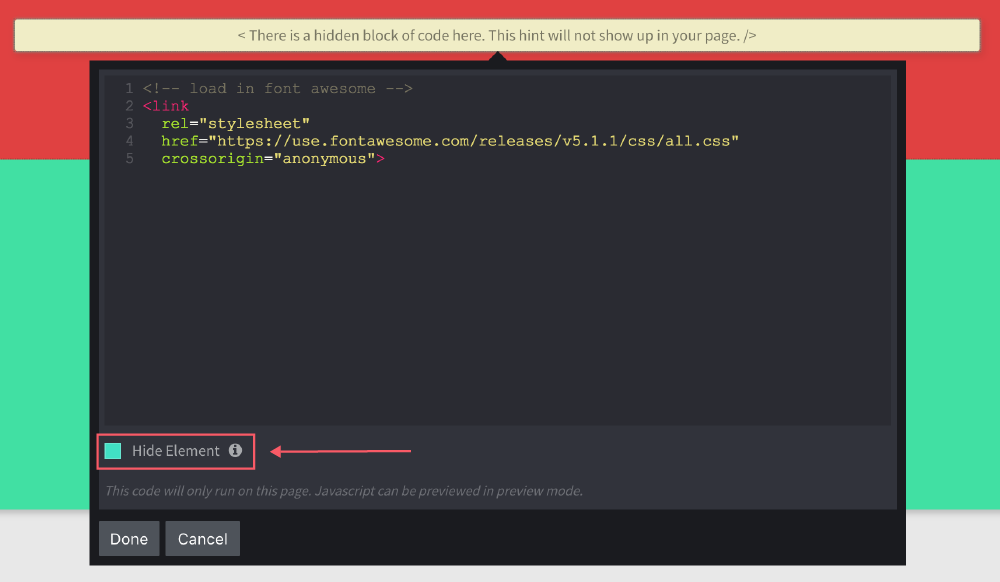

# Overview

Drzzle provides a "General Code" droplet that serves as an API for developers who want to customize anything they want. This droplet is a content block type, therefore it can be placed outside or inside of sections as well as inside of puddles. This droplet accepts any front end code that does not need to be transpiled or compiled (ie. HTML, CSS and Javascript).

## Code Droplet

To get started, simply drop a "General Code" droplet anywhere you wish onto the page and open the edit bubble for it. See Below:

This droplet is great for creating custom components in your pages however it can also be used to run third party code or load outside assets/files behind the scenes.

If you just need to run some code on the page and not build any visual components, then we recommend checking the "Hide Element" checkbox at the bottom of the edit bubble. See Below:

You'll notice that you will see a note block letting you know there is code there for editing.

## Global Code

Currently there is not an option to run code globally throughout the entire website. The closest thing to achieving this is to create a template that every page will use and add the code droplet in that.
