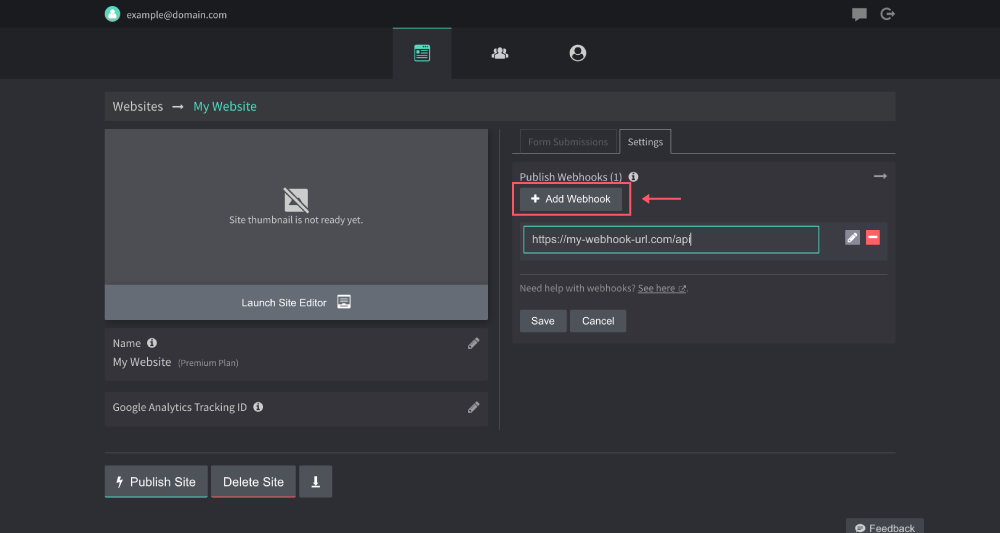
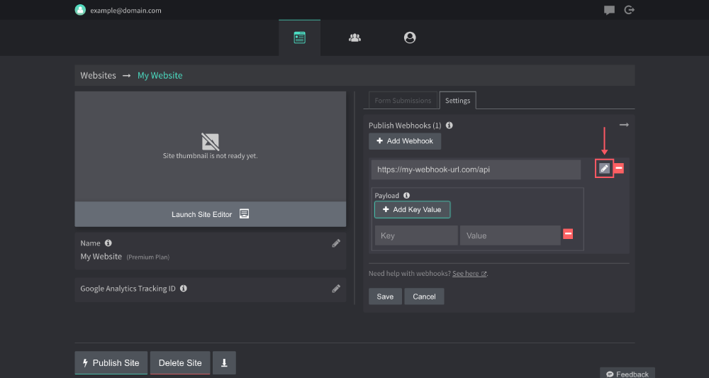
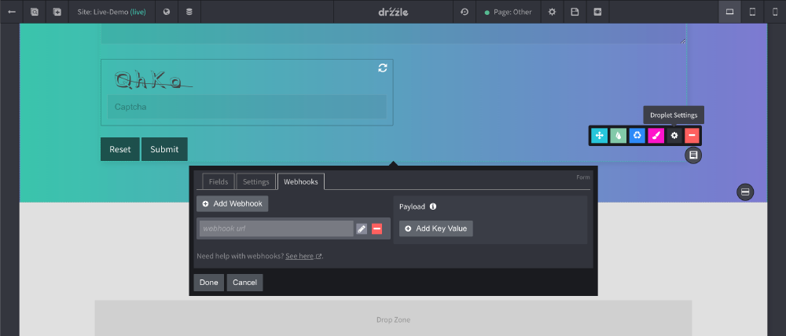
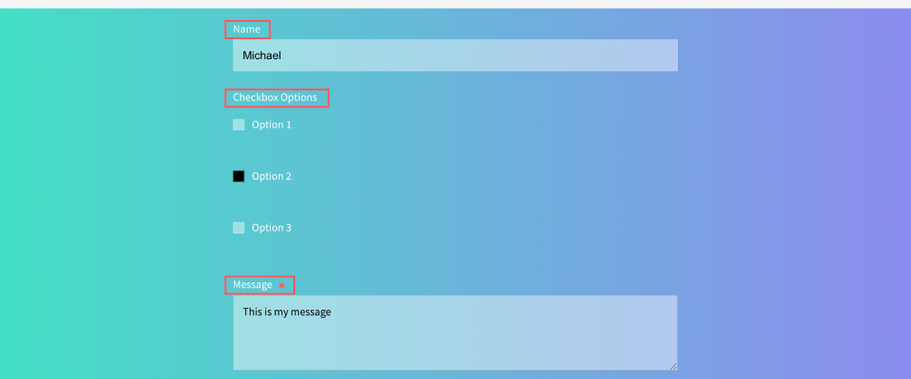

# Webhooks
Webhooks are available through certain droplets and events.

## Publish
You can add one or more webhooks on publish events. These events include each time a page or site is published within the admin panel or site editor. To add a publish webhook, follow the steps below:

1. Navigate to the site's settings tab inside the admin panel.

2. Click "Add Webhook" and paste in the url.


3. If you would like to add custom key/values to the webhook payload, you can do so by clicking the edit pencil next to the webhook URL.


4. After you're done, click "Save" and you're ready to go!

#### Payload
The JSON payload that will be sent to your webhook endpoint will always consist of the following:
```JSON
{
  "_meta": {
    "siteFiles": "array of all site files",
    "siteName": "site name string",
    "siteId": "site id string",
    "timeStamp": "published date string"
  }
  .. your custom payload
}
```

#### Lambda Publish Template
If you own an AWS account, we have put together a Lambda template you can use to handle some of the backend work needed for publishing your site files to a server. See the following Github Repo for more on that.

[Site Publish Hook](https://github.com/drzzle-app/site-publish-hook)

## Form Droplet
The form droplet offers a webhook option. You can have up to 10 webhooks per form. Webhooks here will run after a site visitor successfully submits your form. To open the webhooks settings do the following:

1. Hover over the form droplet options and click `Droplet Settings`. Then click the `Webhooks` tab.


2. Click add webhook and enter your endpoint url. It's that easy.

#### Payload
The form's JSON payload that will be sent to your endpoint will always consist of the following:
```JSON
{
  "_meta": {
    "siteName": "string",
    "siteId": "string",
    "pageName": "string",
    "pageUrl": "string",
    "pageId": "string",
    "dropletId": "string",
    "submitted": "date string"
  }
}
```
#### Adding to Payload
Your form fields will automatically be added to the payload by label and value the visitor submits.

Take a form with these fields for example:


The payload sent to your endpoint, after a successful submission, would look like this:
```JSON
{
  "_meta": {
    "siteName": "my site name",
    "siteId": "my-site-id",
    "pageName": "page 1",
    "pageUrl": "https://mydomain.com/contact-us",
    "pageId": "my-page-id",
    "dropletId": "form-droplet-id",
    "submitted": "2021-01-01T19:12:03.310Z"
  },
  "Name": "Michael",
  "Checkbox Options": "Option 2",
  "Message": "This is my message"
}
```
