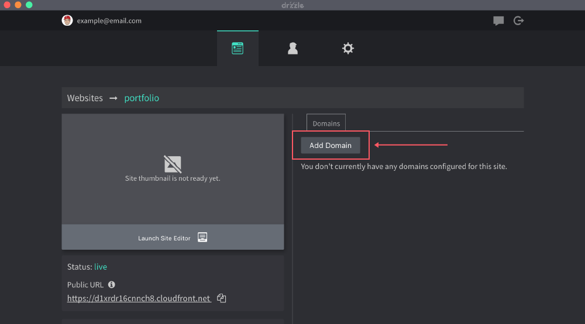
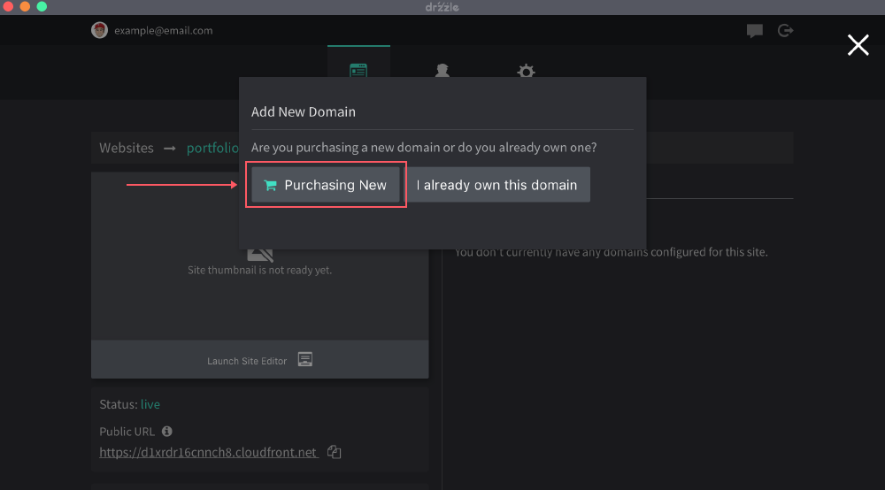
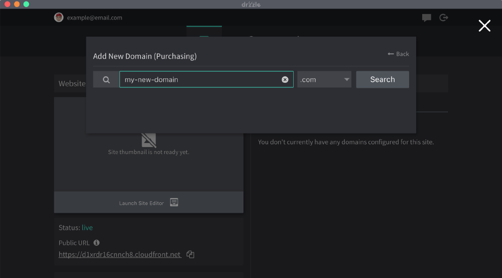
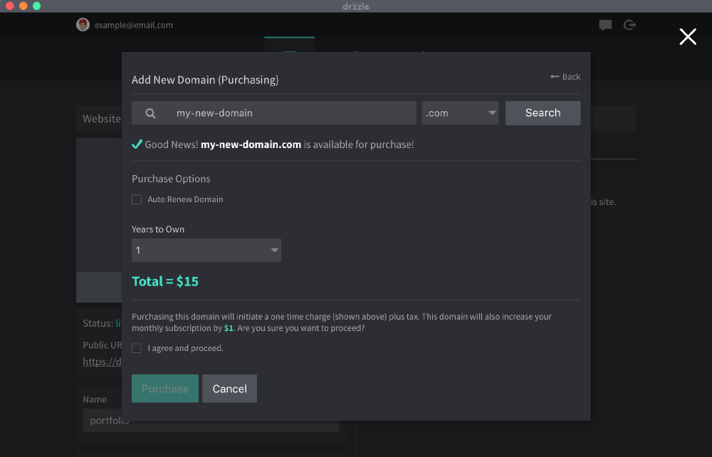
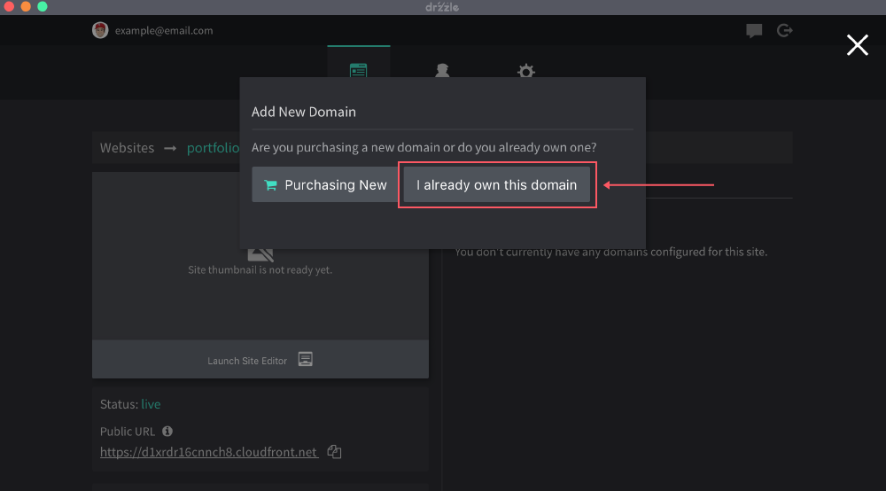
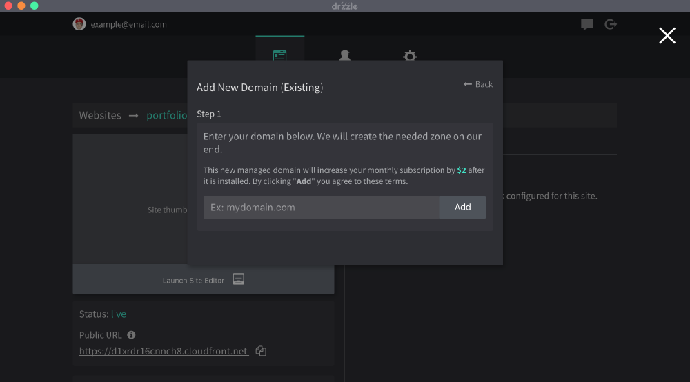
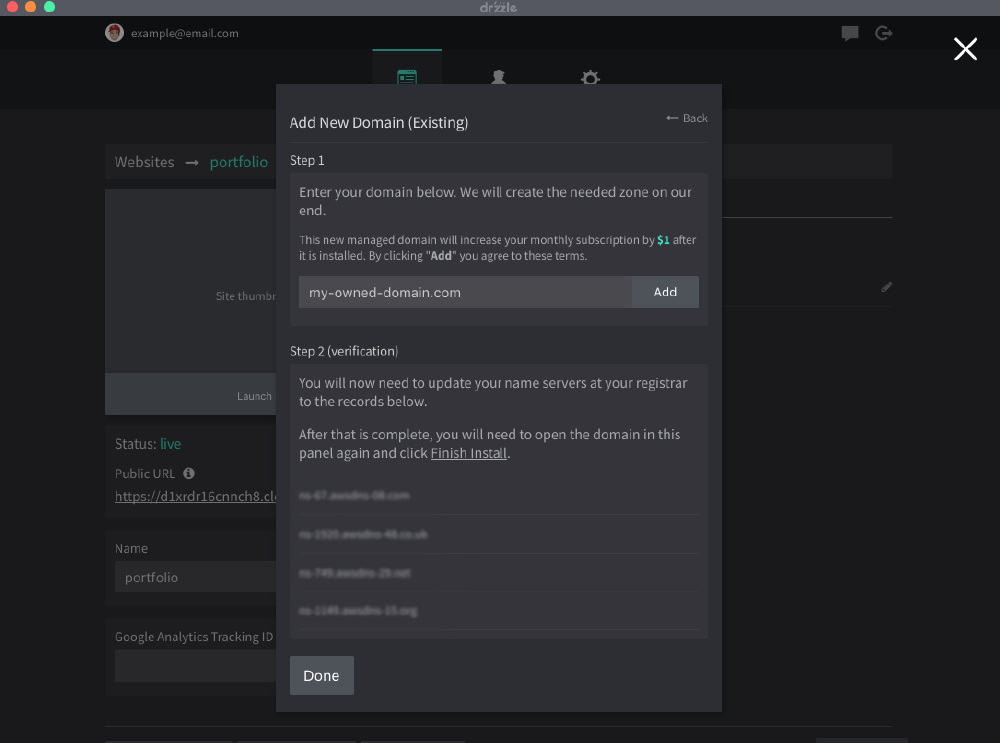
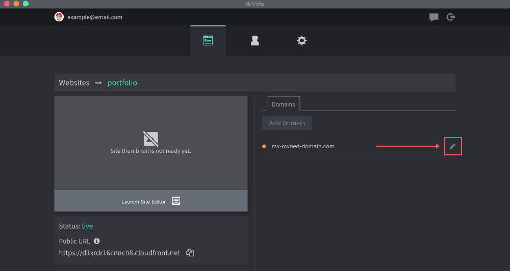
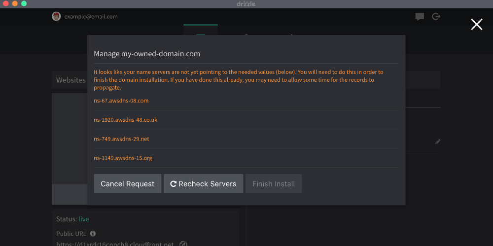

# Adding Domains

Domains are added on a per site basis and you can add as many as you like. To add one, you will need to open the site's basic website settings page from the Admin Panel. When adding a new domain, a new SSL certificate will automatically be issued to cover it.

## Purchasing
Follow these steps to purchase a domain name

1) Click on the "Add Domain" button from the site's "Domains" tab.



2) Click on the "Purchasing New" button.



3) Search for the domain you would like to buy. Here you can see if it is available for purchase.



4) Finally, once you find a domain available for purchase, select the amount of years you would like to purchase it for, decide if you want to auto renew it or not then click purchase.



By default, if you purchase a domain through our application, the registrant contact information is our information, however we
can change this to your contact information for you at your request. Here is what that looks like:
```
Address: 3918 Clark Ave. PO Box 23392
City: San Antonio
Contact Type: COMPANY
Country: US
Email: admin@drzzle.com
First Name: Drzzle
LastName: LLC
OrganizationName: Drzzle
State: TX
Zip Code: 78223
```

## Pre-Owned
If you already own a domain, you will need to point your name servers to ours so that we can setup the needed records for you on our end. See below for step by steps instructions.

If you wish to keep your domain's name servers and manage records on your own, you will need to contact support at ```support@drzzle.com``` to get the correct records.

Steps:

1) Click on the "Add Domain" button from the site's "Domains" tab.


2) Click on "I already own this domain"



3) Enter your domain name without any subdomain/www. For example: ```mydomain.com```. Then click "Add".



4) You'll see a set of new name servers. You'll then need to go and set them at the registrar where you bought your domain. Contact your registrar if you need assistance.



5) After the new name servers are successfully set on your end, you can check the status of the domain by opening the edit domain modal. Once the nameservers are recognized, the last step is to click on "Finish Install".





Once this is all complete, you will now be able to create DNS records within the Admin Panel.


<!-- ### Method Two - Keep your name servers
The second method is best suited for those that do not want to pay the small monthly fee for the domain or do not plan on using your domain for other services. The caveat here is that you will need to manage your DNS records yourself.

1) Click on the "Add Domain" button from the site's "Domains" tab.


2) Click on "No I want to leave it"


3) Enter your domain name without any subdomain/www. For example: ```mydomain.com```. Then click "Add".


4) Finally, you will need to set a CNAME record for your domain at your registrar to the value that Drzzle gives you in this step.


As this method means that you will be editing your DNS records on your own, there are a few things to keep in mind. Depending on your domain's TTL, changes can take effect from anywhere between 5 minutes to several days. If your domain is using a service like email, a CNAME record will likely disrupt it. Having your domain not managed in our panel also disallows our support to assist in setting up records for you. -->
