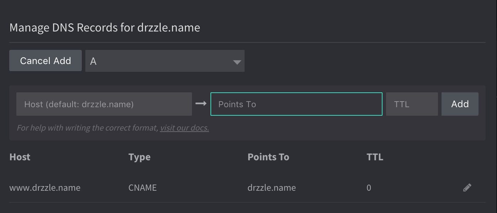

# DNS Records
In the Manage DNS modal, users have the ability to add, delete and edit DNS records for their domains.


## Points To Values
The following formats are referring to the values entered in the "Points To" input. See below examples.



### A Record
A records should be entered in IPv4 format with dotted decimal notation.
```
192.0.2.1
```

### AAAA Record
AAAA records should be entered in IPv6 format with colon-separated hexadecimals.
```
2001:0db8:85a3:0:0:8a2e:0370:7334
```

### MX Record
MX records should always contain 2 values. The first is the priority and should be a number value (the lower the number the higher the priority). The second value is the domain name of the email server.
```
10 mail.example.com
```

If you need to add multiple MX records you can separate them with a comma. See example:
```
10 mail.example.com, 20 mail2.example.com
```

### TXT Record
TXT records have a more complex format. Typically they are one or more strings that are case sensitive. Do not enter double quotes ```"``` at the beginning or ending as Drzzle does this for you. If you do need to use double quotes in your string, you will need to prefix each with a backslash, like so ```\"```.

A single string can include up to 255 characters, including the following:

- a-z
- A-Z
- 0-9
- Space
- (hyphen)
- ! " # $ % & ' ( ) * + , - / : ; < = > ? @ [ \ ] ^ _ \` { | } ~ .

Example:
```
v=spf1 ip4:192.168.0.1/16 -all
```

### SRV Record
SRV records should contain four space-separated values. The first three values are numbers representing priority, weight, and port. The last value is a domain name.
```
10 5 80 hostname.example.com
```

## Host Values
The following formats are referring to the values entered in the "Host" input. See below examples.


### CNAME Record
CNAME records should be entered in the domain name format. You cannot use a top node of a DNS namespace. For example ```mydomain.com``` doesn't work but ```subdomain.mydomain.com``` will work.
```
hostname.example.com
```
