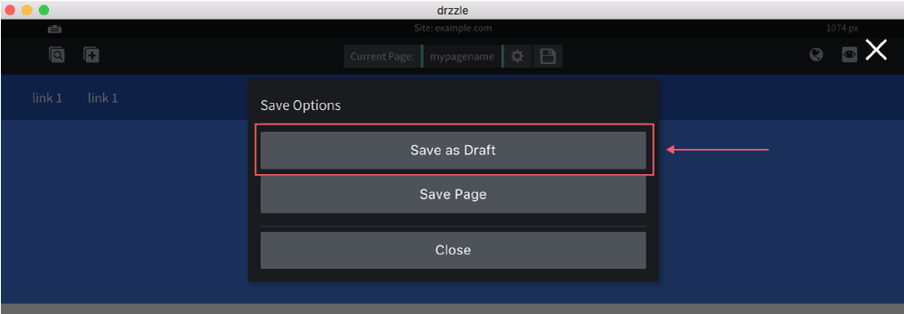

# Creating Drafts

Drafts can only be created from pages. Currently you cannot create them from templates. Creating drafts will basically create a copy of a page in the state that it is in. Please keep in mind that if you create a draft from a page and you go and edit the original page afterward, the draft will not get those updates.

To create a draft follow the steps below:

1) Click the "Save Options" button in the top control bar.

2) Click the "Save as Draft" button in the Save Options modal.

That's all there is to it. After step 2, you will be redirected to the new draft page and you will be able to also see the draft in the "Search Pages" modal. Remember that a draft is like a copy of a page that users can toy with. Saving the draft directly won't change any live content.
