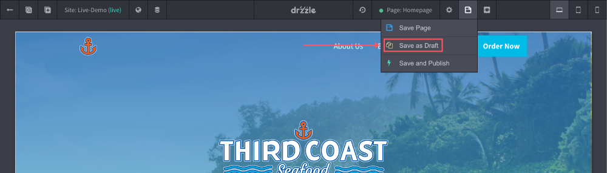

# Creating Drafts

Drafts can only be created from pages. Creating drafts will create a copy of a page in the state that it is in. Please keep in mind that if you create a draft from a page and you go and edit the original page afterward, the draft will not get those updates.

To create a draft:

1) Click the "Save Options" button in the top control bar and click "Save as Draft".

