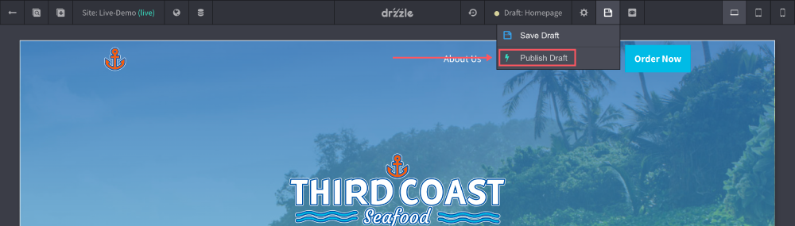

# Publish Drafts

Publishing a draft will replace the original page with the draft and publish it live on the web. To do this follow the steps below:

1) On the draft page, click the "Save Options" button in the top control bar & click "Publish Draft".

Keep in mind that after publishing the draft there is no way to revert the original page back. After the original page has been updated with the draft, the old draft will then be deleted.
