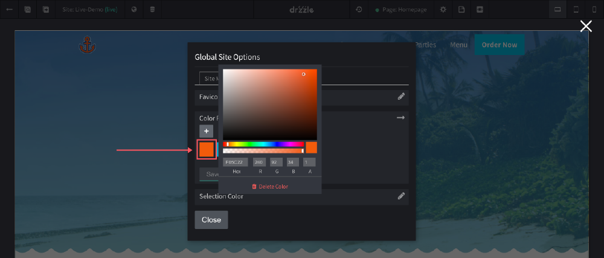

# Color Palette

## Overview
You can add and remove colors to each site's palette using the global site options located in the top control bar of the page editor.

## Adding Colors
1) Click on the "Colors" tab in the global site options area.

2) Click "Add Color" and it should add a white box to your palette. You can then set that color to whatever you need to.

3) You can now use your saved color in any droplet or page color option like so.

