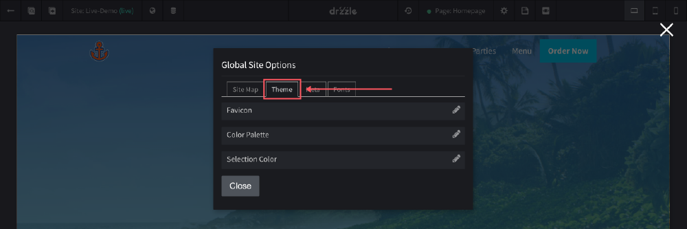

# Favicon

## Overview
A favicon is that tiny icon that shows up in a web browser when visitors are on your website. See Below:

Although there is no impact with SEO on using them, favicons are a great way to brand your website.

## Uploading
The favicon setting is located in the top control bar of the site editor. Follow the steps below:

1) Click the "Global Options" button.

2) When the modal opens, click on the "Theme" tab.

3) Click on the "Upload New" button to choose a favicon.

## Specifications

Favicon files must adhere to the following specifications:

- Accepted file types: .svg, .ico, .png
- Image size: 32 x 32 pixels
