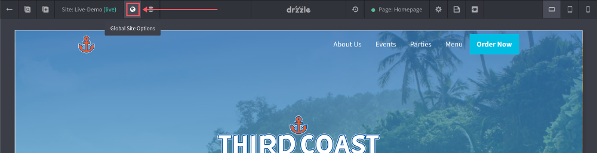
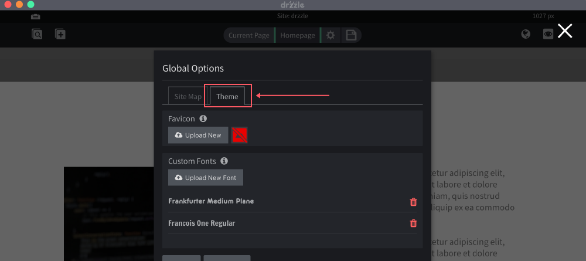
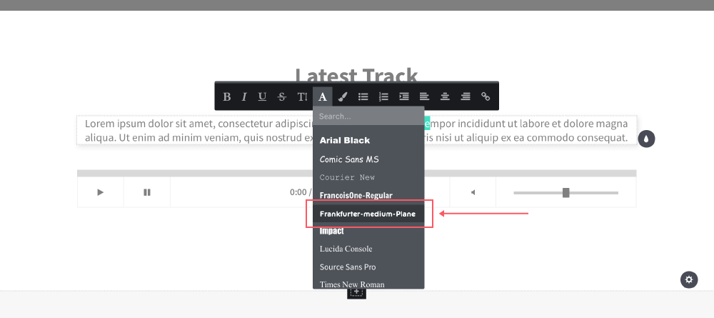

# Fonts

## Overview
Some droplets have the option to change it's font. We have a few default web safe font options, however you can upload your own custom fonts on a per website basis.

## Uploading

The fonts setting is located in the top control bar of the site editor. Follow the steps below:

1) Click the "Global Options" button.

2) When the modal opens, click on the "Theme" tab.

3) Click on the "Upload New Font" button and upload your font.

Once successfully uploaded, you should see the new font option within the droplets that allow font changes

## Specifications

Acceptable font file types are .tff, .otf and .woff. Be sure to name your font file clear and concise as that name will be how it is shown as an option in the editor.

Keep in mind that the more fonts you upload to a website the more assets the website will need to load when published. We recommend keeping your font count from 0-5 per website for optimal performance.
