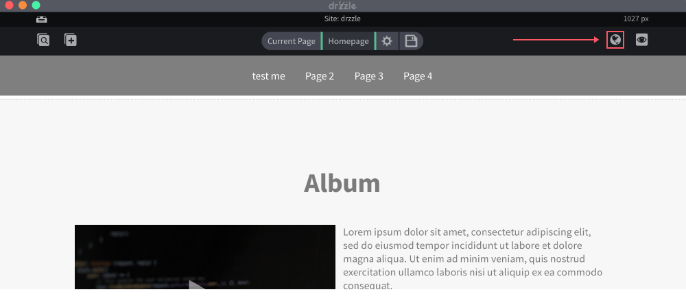
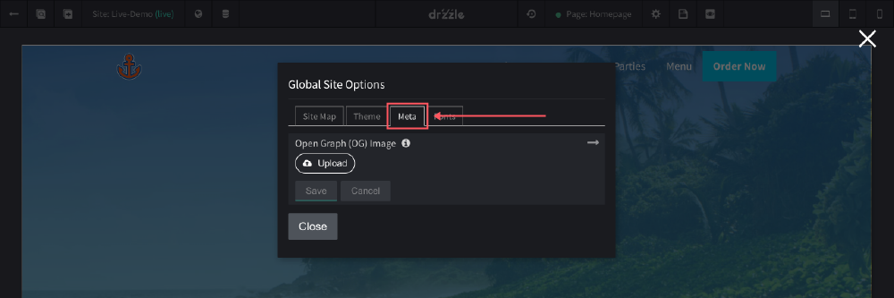

# Site Meta Image

## Overview
The site meta image is used for SEO purposes. It can be seen in various places including facebook, google, slack or anything that displays a website's meta data. See below example:

## Uploading
The meta image is located in the top control bar of the site editor. Follow the steps below:

1) Click the "Global Site Options" button.

2) When the modal opens, click on the "Meta" tab.

3) Click on the "Upload" button and select an image.

## Specifications

The meta image is best viewed at 1200 x 630 pixels.

- Accepted file types: .jpg, .jpeg, .png
