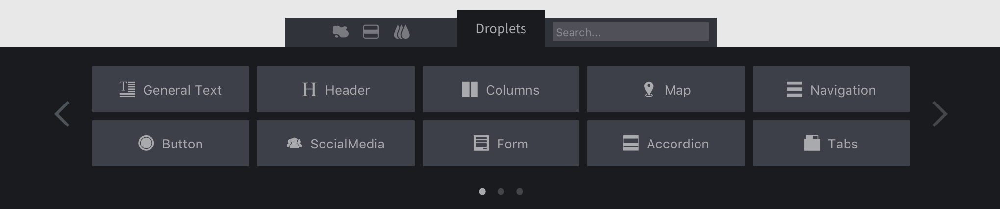

# Glossary

Around the drzzle application, you'll notice some buzz words that may not be super obvious to understand. Here you should find some helpful information on what those should mean.

### Droplet
In general terms, droplets are web components that make up a webpage. They are not limited to a type, rather, they can be a wide range of things, including a video player, some general text, a map, a navigation menu, a button, tabs, cards and the list goes on.

<!-- Maybe we have a separate page for "building a page" where we talk about this -->
<!-- Upon launching the site editor you can see the list of available droplets at the bottom of the screen. Our friendly UI lets you drag and drop these right on the page.

 -->

### Puddle
A puddle is a kind of droplet that can except more droplets into it. Essentially this means that you have the ability to drop certain
droplets into it. Each puddle has a certain set of droplets that are allowed in it.

<!-- Show the helper tooltip and show the droplets tab filter with puddles -->

### Section
A section is just like it sounds. Pages are made up of sections and sections allow droplets and puddles to be dropped in them. You can have an unlimited amount of sections in a page and an unlimited amount of droplets in a section.

### Content Block
A content block is a kind of droplet that can be dropped **_outside_** of a section as well as inside. Essentially these droplets can serve as their own section, however most don't allow _other_ droplets to be dropped in them.
