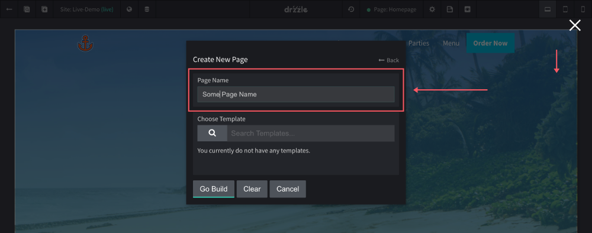

# Creating Pages

Every site will at least come with home page that cannot be deleted. To create new pages for your site, follow these steps:

1) Click the "Create Page or Template" button.

2) When the "Create New" modal is open, click on "Page"

3) Finally, name your page.

You also have the option to use a template for your page. Keep in mind that once a page is created with a template, the templated sections cannot be removed from the page. They can only be removed from the template itself. See more on templates [here](/templates/creating/#using-the-template).

From here you should be taken to your new page where you can start creating your content.
