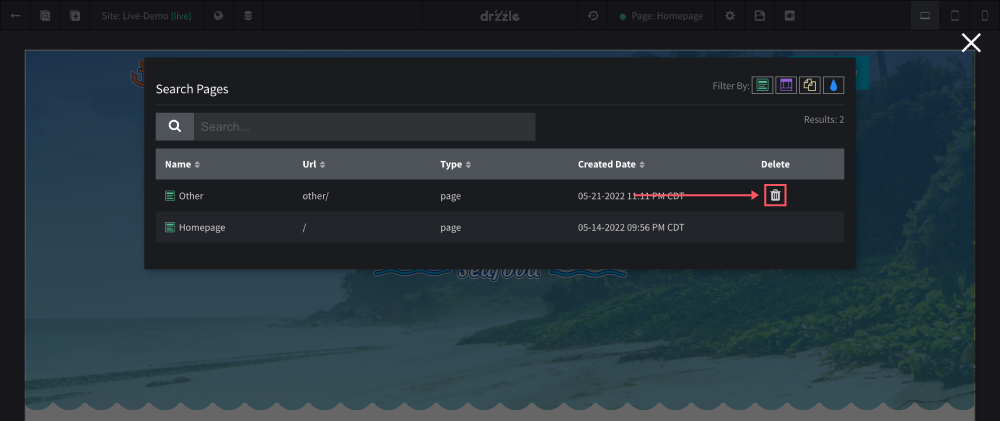
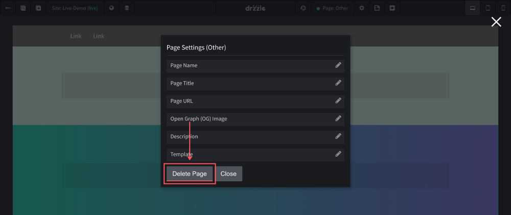

# Deleting Pages

There are some things to note about deleting pages. The first is that there are two places where you can delete a page. Both methods are done in the top control bar of the site editor. We will cover more on those below. The second note is that the home page cannot be deleted and the last is that, you cannot delete a page if it has sub pages in the site map. For more information on the site map see this [site map section](/global/sitemap/#page-children).

## From Search Modal
You can delete any type of page from the search modal just as long as you see a solid trash can on that page's row. If you see a trash can that is somewhat transparent, it is because the page cannot be deleted. To see the reason a page cannot be deleted, you can hover over the trash can and it should give you that information.

## From Page Settings
The other place that you can delete a page is on the settings modal of the page you are on.

