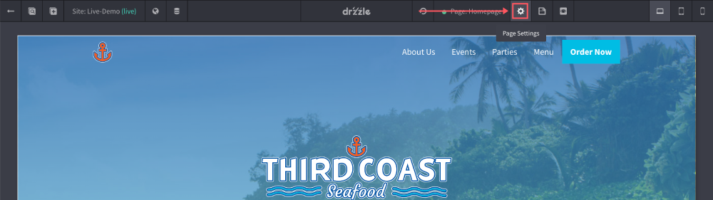
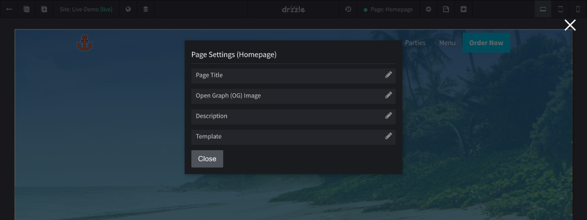
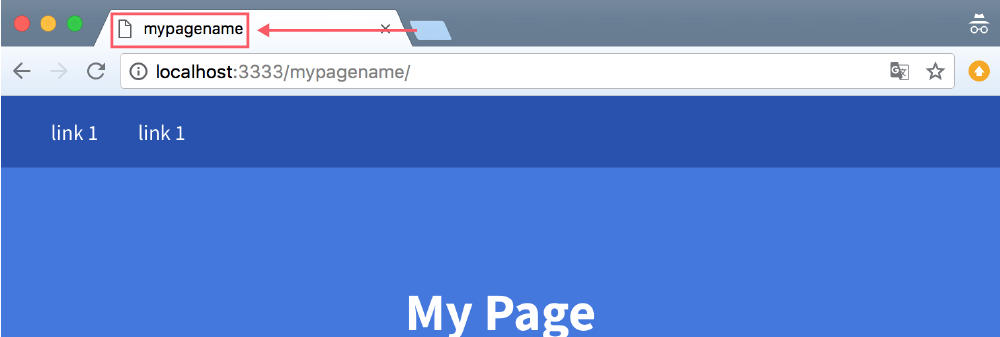

# Editing Pages

## Settings
Aside from adding droplets and sections to pages, each page has it's own SEO, url and name settings. To edit them follow these steps:

1) Click on the page "settings" button in the center of the top control bar.



2) Update the settings you want to change.



## Page SEO
If you are not familiar with SEO, it stands for Search Engine Optimization and is essentially the practice of optimizing web pages in order to rank higher and earn more relevant traffic in search engines like Google. The page settings modal is where you can improve SEO on your pages.

The page name for instance is important as it will show up in your page ```<title>``` tags when your page is being served on the web. The name will show on visitor browser tabs when on that page.



You also have the option to manually create your page URL to a more descriptive name which can result in better off page SEO.

And finally, the page description, although not required, is highly recommended for better SEO on your pages. It is best practice to keep this description at 155 characters or less. This description would show up in search engines or social media posts as sort of a descriptive preview when sharing a link to the page. The below example is a facebook post sharing a link to our website:


