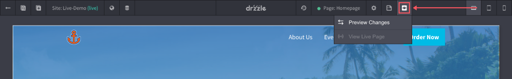

# Previewing Pages

The site editor is very close to what pages will actually look like minus all of the controls. To get a better look, you can use the "preview" button in the top control bar. This should launch a preview using your default browser with the page your editing.

Please bare in mind that in preview mode, some links (like email links) may not work as intended as the preview is not using a production web server to serve the entire website.

## Viewports

Currently, to see the pages in mobile or tablet views you just need to resize your browser to the appropriate size.
