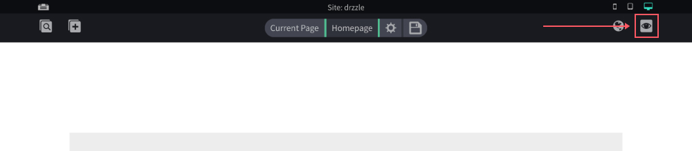
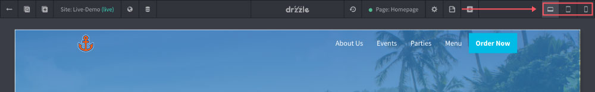

# Previewing Pages

The site editor is very close to what pages will actually look like minus all of the controls. You will have 2 options for previewing the page you're on.

1. **Preview Changes** - Here you can preview what your page will look like in a browser before you publish it.

2. **View Live Page** - This will link you to the live published version of the page you are on. Not every website will have this option. Only hosted sites.

## Viewports

There are currently 3 preview viewports available. You can toggle between mobile, tablet and desktop sizes by clicking on one of the following.

