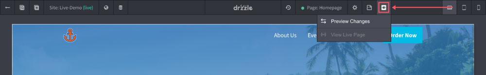

# Previewing Pages

The site editor is very close to what pages will actually look like minus all of the controls. Hosted websites have the "preview" option. To see what the website output looks like without the editor, click on the "preview" button.

## Viewports

There are currently 3 preview viewports available. You can toggle between mobile, table and desktop sizes by clicking on one of the following.

