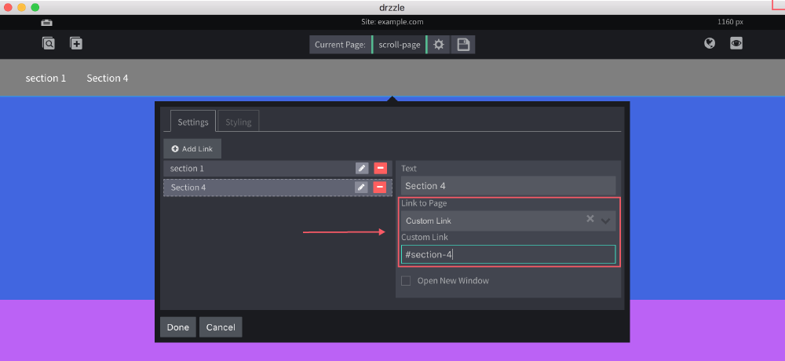

# Anchor Scrolling

Anchor scrolling is a technique in which a link is clicked and the page scrolls to a certain section within the same page. Currently this can be done with the navigation droplet.

Here is an example of the end result:


To enable this on a page, follow these steps.

1) Pick the section that you would like to scroll to and open it's edit modal.


2) Next give your section an id name and click done.


3) Open the navigation's edit bubble and click the edit pencil on the link you wish to do the scrolling.


4) In the "Link to Page" field, select "Custom Link". Then enter a pound character ```#``` followed by the id name that you created in step 2. The end result for this example would be ```#section-4```.



5) Finally, click done in the navigation bubble and save the page.
