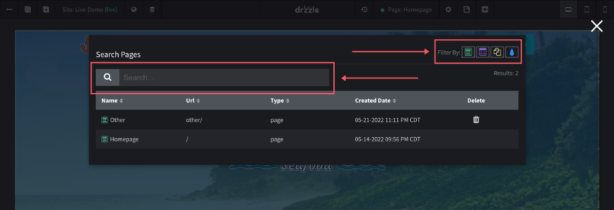

# Searching Pages

In order to find and edit any page type (pages, drafts and templates), you will need to use the "Search Pages" tool in the site editor. To do this follow the steps below:

1) Click on the "Search Pages" in the top control bar.

2) When the search modal is open, you can filter pages by type (pages, drafts or templates) or can search by name and date.

Clicking on a page will take you to that page in the site editor. If you have unsaved changes on the page you were working on, you should be prompted to save if you want.
