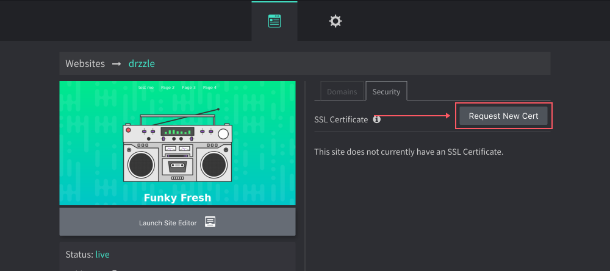
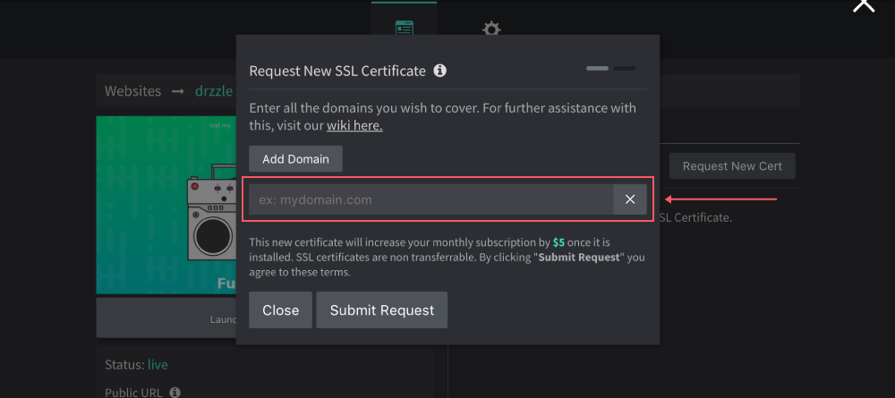

# Adding SSL Certs

## Overview
Having an SSL (Secure Socket Layer) Certificate is a way to secure data being passed from your visitor's web browser to the server that is hosting your site by encrypting it. As newer versions of web browsers are starting to demand this type of security for websites, it is recommended that you install one. If your site does not have an SSL certificate and a visitor is using a browser that requires one, the visitor may get a "Not Secure" warning.

SSL Certificates are added on a per site basis and you will not be billed for them until it is successfully installed. You can only have one certificate per site but you are not limited to the amount that you can request under your account. To request and install one, you will need to open the site's basic website settings from the Admin Panel and follow the steps below:

## Requesting

1) Click on the "Request New Cert" button from the site's "Security" tab.



2) You can add multiple domains and subdomains that you want covered in the certificate but there is a maximum of 10 names. To help illustrate how to request names, say you have a domain (mydomain.com) and you want this covered in your certificate along with (www.mydomain.com). There are two things you can do. The first is you can submit the first name as ```mydomain.com``` then click "Add Domain" and submit ```www.mydomain.com``` as the second name. The other thing you can do is submit the first as ```mydomain.com``` and the second as ```*.mydomain.com```. The latter option is known as a wildcard and is a good option if you want to cover **_any_** subdomain for mydomain.com. Click "Submit Request" when complete.



3) The next step is a verification step and it entirely depends on the domains that you submitted.

**Scenario One**

If all of the domains you submitted are managed through Drzzle, meaning you either bought the domain through our panel or the domains name servers are pointing to ours, the app will auto verify that you, in fact, own them and will automatically install the certificate for you and you do not need to do anything further.

**Scenario Two**

If any of the domains you submitted are ***NOT*** managed through drzzle, then you will need to verify those manually. You will need to do this by adding a CNAME record for each domain. The verification step will show you the values you need to submit at your registrar. Once you are finished and the records are done propagating (this depends on your domain's TTLs), you will need to come back to the request in the admin panel and click on "Finished Verification". After Drzzle re-checks those records for all of the pending domains and all is verified, it will finally install the certificate.


Scenario Two can be a daunting step, especially for non technical users and is another reason we recommend pointing your name servers to ours so that we can manage that kind of thing for you.

## Post Install

After your SSL certificate is installed, visitors will see the green secure lock on all of your webpages for that website. Your HTTP traffic will also always be redirected to HTTPS.


