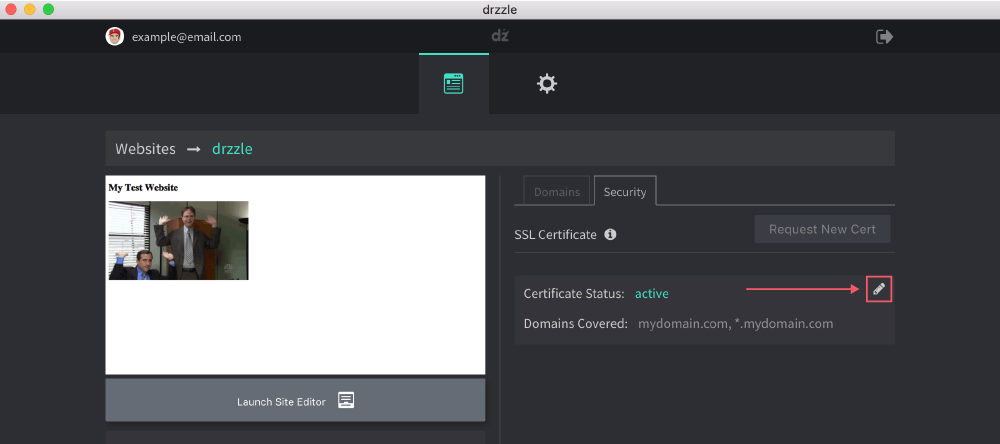

# Deleting SSL Certs

Deleting certificates is a simple process. Follow the steps below:

1) Click on the edit pencil button on the certificate you want to change.

2) In the "Edit Certificate" modal, click on the "Delete Certificate" button.

You should be prompted with a confirmation and once you click "yes" your certificate will be uninstalled from your website. At this point you will have the ability to request a new one.
