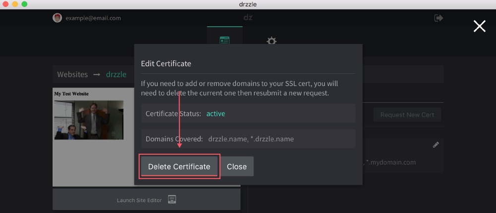

# Editing SSL Certs

Whether an SSL certificate is installed or pending verification, you cannot edit it directly. If you want to add or remove domain names, you will need to delete the current cert and request a new one. Follow the steps below to do so:

1) Click on the edit pencil button on the certificate you want to change.

2) In the "Edit Certificate" modal, click on the "Delete Certificate" button.

From there, you will need to re-request one. See [Requesting New Certificates](/ssl/adding/#requesting)
