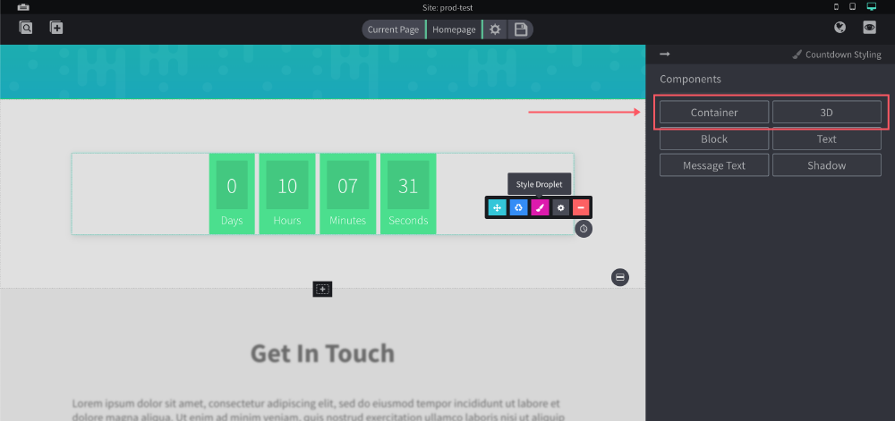
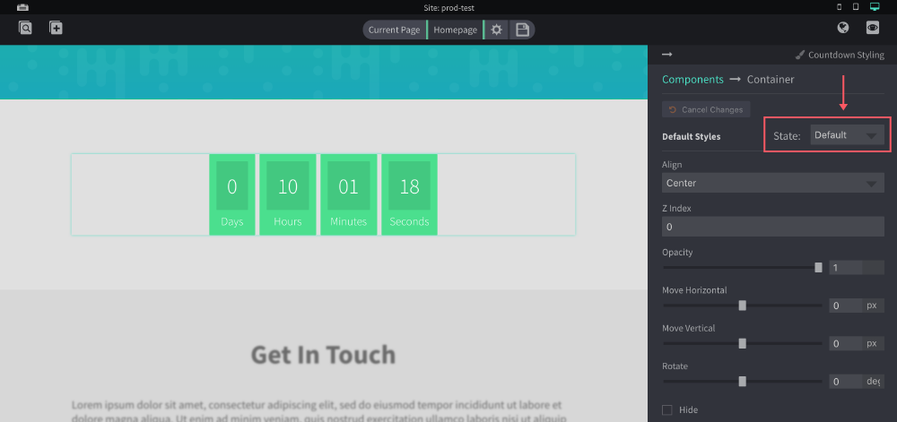
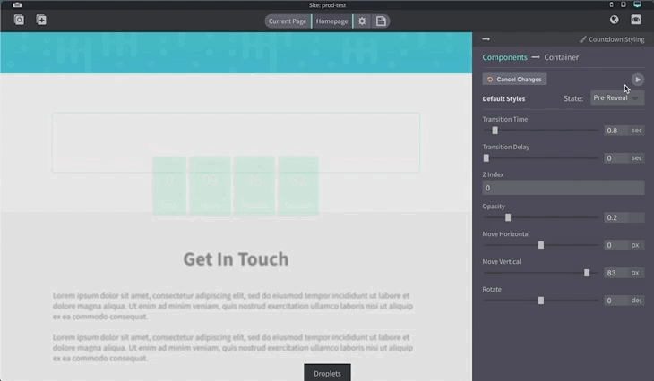

# Reveal Animations

You can give droplets some extra flare with reveal animations. These are animations that run only once as soon as the droplet becomes visible on the page.

When creating reveal animations, you can think of things in a start and end position.

## Overview Steps
Open the style bar for the droplet you want to create an animation for. Currently the **Container** and **3D** components have reveal options.

## Ending Position
You can think of the **Default** state as where the droplet will end _after_ the animation is complete. It may make sense to leave the values here unchanged.

## Starting Position
The **Pre Reveal** state would be where the droplet is _before_ the animation starts. Aka the "starting" position of the animation.

## Previewing

You can see a preview of the animation by clicking the play button. In this example we gave the starting position, for this droplet, a lower opacity, moved it lower vertically and added some transition time for a smooth transition.

