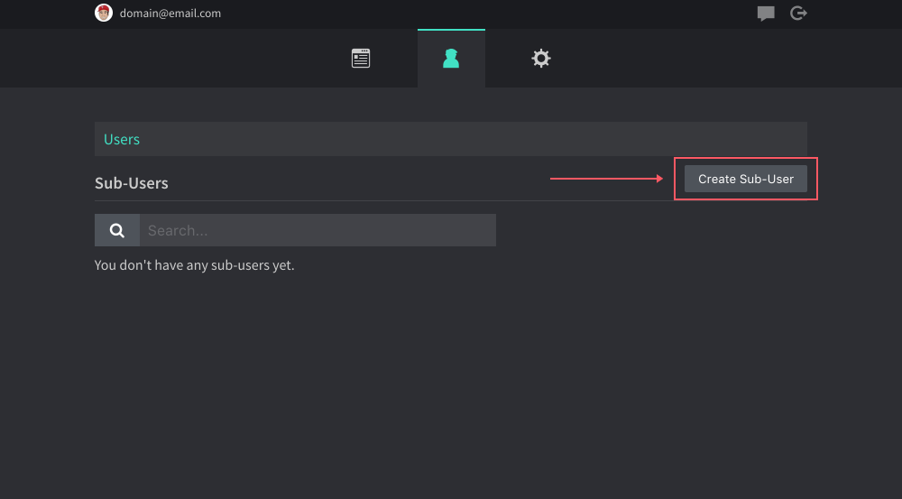
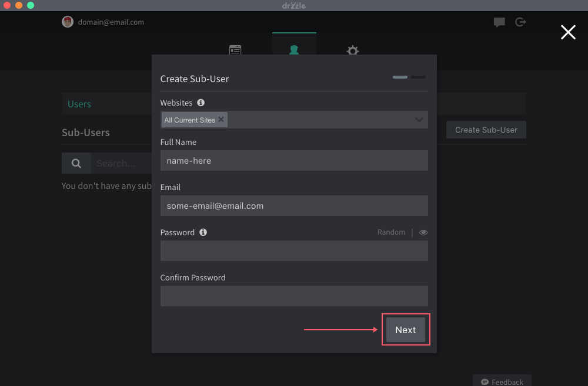

# Creating Sub-Users

Account owners are not limited to the amount of sub-users they can add. Adding a sub-user is very simple, just follow the steps below.

1.  Navigate to the admin panel and to the users tab.

2.  Click on "Create Sub-User"

3.  Choose the websites you wish to give this user edit permissions to. Then enter their name, email and new password. The sub-user will have the ability to change their password later. Click "Add and Invite Sub-User" when done.

The sub-user will be emailed a confirmation code. They will need that the first time they login to the app.

Owners will always be able to go back and change the website's that they want the sub-user to have edit permissions to.
