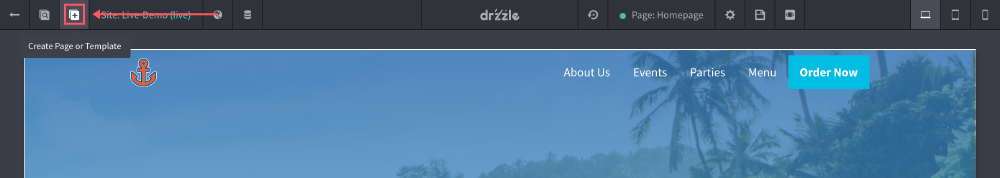

# Creating Templates

Templates are great for websites that have two or more pages that need the same droplets or sections on them. Typically they are things like navigations and footers. Creating templates is the same process as creating a page. See below for steps:

1) Click the "Create Page or Template" button.

## Using the template

Speak of no extra sections
