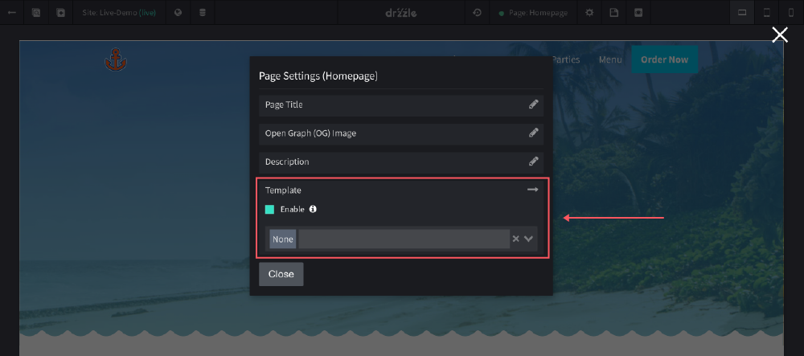

# Creating Templates
Templates are great for websites that have two or more pages that need the same droplets or sections on them. Typically they contain things like a navigation and footer.

## Adding
Creating a template is the same process as creating a page. See below for steps:

1) Click the "Create Page or Template" button.

2) Click on "Template"

3) Finally, name your template

From here you should be taken to a blank template where you can start creating your reusable content.

## Using the Template
There are two ways to use a template.

1) When you first create a page, you have the option to select a template to start from:

2) If you create a template after a page has already been created, you can open the page settings modal and select to use it from there:

You may need to rearrange the template items after they get injected into the page.
