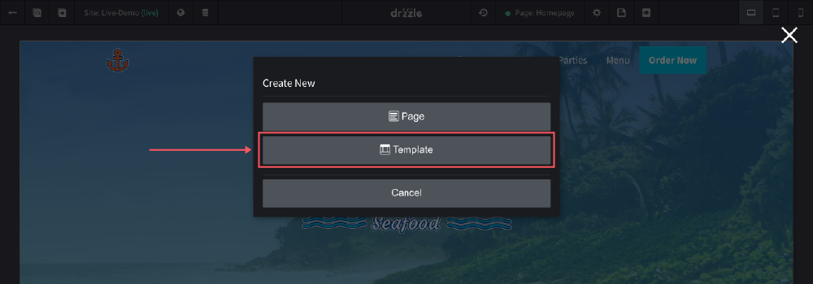
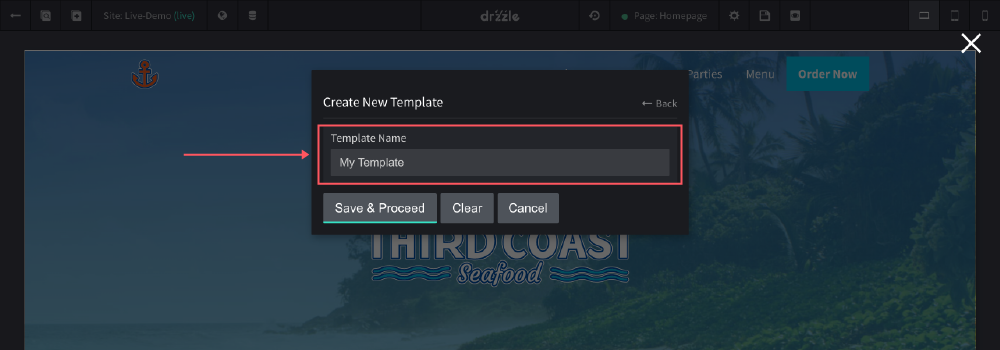
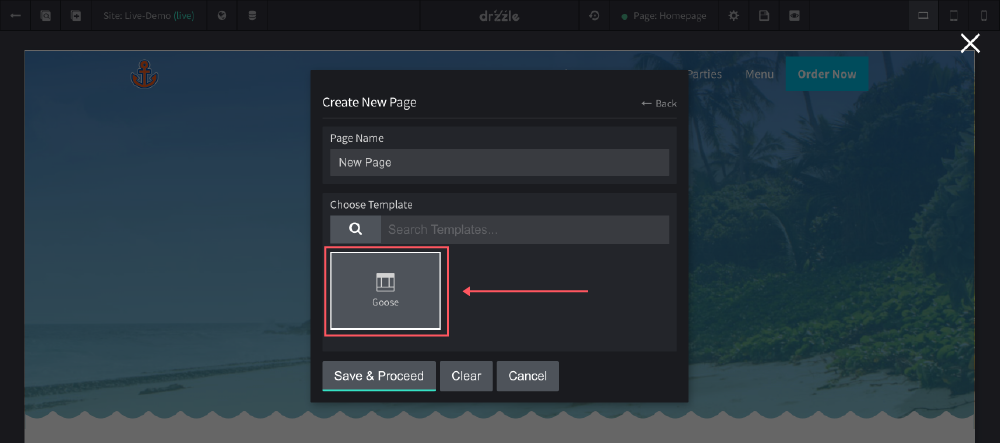

# Creating Templates
Templates are great for websites that have two or more pages that need the same droplets or sections on them. Typically they contain things like a navigation and footer.

## Adding
Creating a template is the same process as creating a page. See below for steps:

1) Click the "Create Page or Template" button.

2) Click on "Template"

3) Finally, name your template

From here you should be taken to a blank template where you can start creating your reusable content.

## Using the Template
To allow your pages to use a template, you will need to select the template when creating a new page like so:

Currently, it is not possible to add a template to a page that has been created already without one. The only way to use one is during the initial "Create Page" step.
