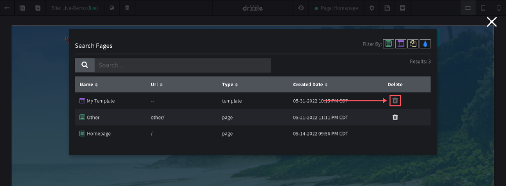
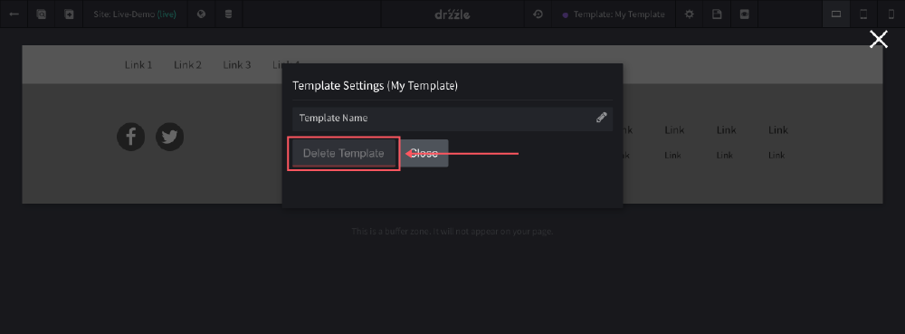

# Deleting Templates

There are two places where you can delete a template. Both methods  are done in the top control bar of the site editor. We will cover more on those below. Another thing to note is that you cannot delete a template if it is in use by one or more pages.

## From Search Modal
You can delete a template from the search items modal as long as you see a solid trash can on that template. If the trash can is disabled you can hover over it to see the reason the template cannot be deleted.

## From Template Settings
The other place that you can delete a template is on the settings modal of the template you are editing.

