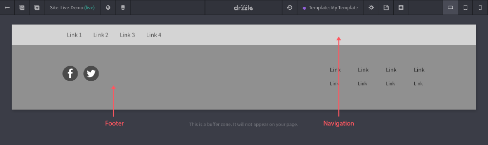
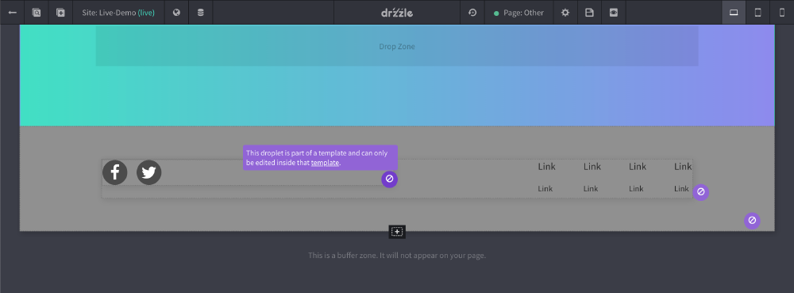

# Editing Templates

## Best Practice
When creating templates, be sure to only include elements that are reusable and not any extra unneeded sections as template content is only editable _inside_ of the template. For example, if you are creating a template with a navigation and a footer, it would look something like this:

## Where Allowed
If you are trying to edit a page that is using a template you may notice unconventional behavior, like not being able to drop, move or edit droplets and sections but bare in mind that this is likely because it is part of the template that the page is using. You can see what content is part of a template by hovering over things. If something is part of a template, you'll notice that there is a purple "not allowed" icon in place of the standard options icons like so:

These warning tips include a link to the template, just in case you need to quickly jump to them for editing.

## Adding Content Later
If you have a template that is in use already by pages, and you try  and add more sections to the template, keep in mind that there may be some overlap. If the page has it's own sections around the template content, then what will happen is Drzzle will take it's best guess on where to place them by merging in the new template sections where it is in the template and will bump down the page sections. In other words, the template sections will take precedence over the page sections.
