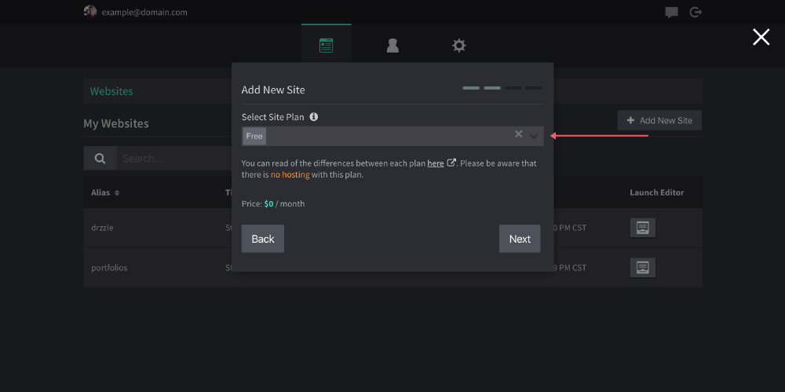
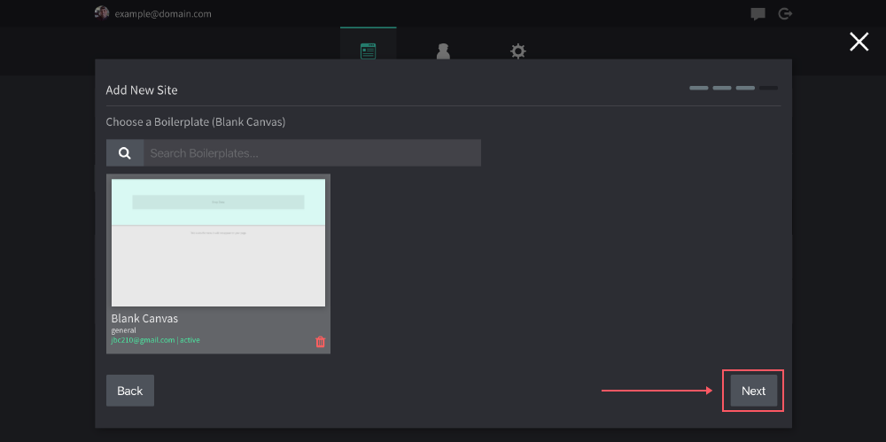
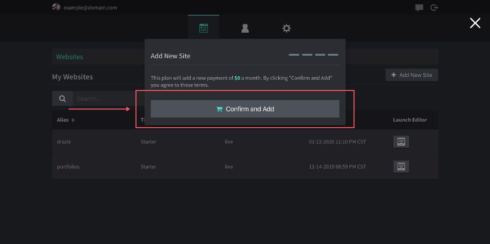

# Adding Websites

Users are not limited to the amount of websites they can add. Adding a new website is very simple, just follow the steps below.

1.  Navigate to the admin panel and to the websites tab.

2.  Click on "Add New Site"

3.  Fill in your new site name and click "next"

4. Select the plan option for this site (free, starter or premium). You can read of the differences <a class="prev" href="https://drzzle.app/pricing/">here</a>.

5.  Select a boilerplate to start from then hit "next".

6.  Finally, you will see a confirmation message before you agree to proceed. The message will depend on if there is an additional charge or not.

After this, you should launch right into the site's settings view. From there you can edit basic global settings and you can also launch the drag and drop site editor.

## Publishing

After a new website is first created, it can take up to 10 minutes for it to be live on the web. Once it's ready, the default "construction" page will be shown.

In order to publish your pages, you will need to launch into the site editor, open the save modal in the top control bar and hit "Save & Publish Page".
