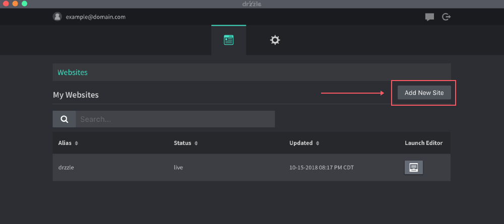
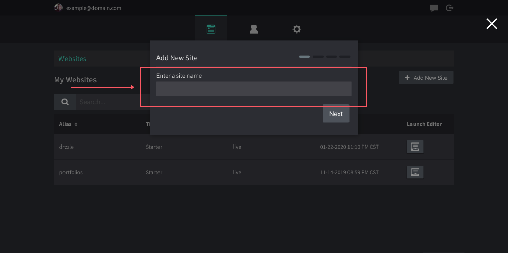

# Adding New Websites

Adding a new website is extremely simple, just follow the steps below.

1) Navigate to the admin panel and to the websites tab.

2) Click on "Add New Site"

3) Fill in your new site name and click save

You should see your new site show up in the "My Websites" list. To start editing the website's content, you can click the "launch editor" button.
