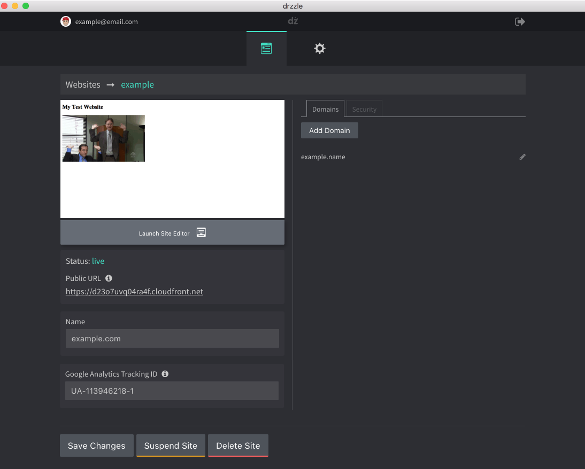

# Website Settings

After creating a new website _or_ by clicking a site from the "My Websites" list, you will be taken to the site's basic settings page. See example below:

## Public URL
Your site's public url is a URL automatically generated when your site is first made. It is a URL that should be publicly accessible to anyone unlike the site editor preview URL.

## Google Analytics
In this settings page, you can enter your Google Analytics ID if you have one. This will embed the GA script in each page of your website.
